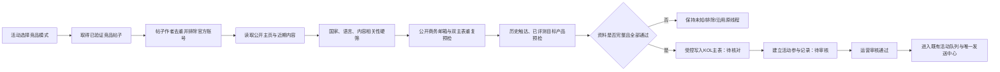

# KOL竞品证据候选供给规格 v1

日期：2026-08-23
适用范围：集中宣发模式；不改变常规KOL自动派单和唯一发送中心。

## 1. 业务目标

运营创建KOL任务时，只需提供产品、市场、目标数量与可选竞品信息，系统便能持续补充合适且可触达的候选。Frankie只审规则和异常，不逐个决定“下一轮搜什么词”或逐条检查普通候选。

该功能替代的是“候选池不足后，人反复决定去哪里找、用什么词找、哪些竞品作者值得优先”的重复决策。最终成功标准不是关键词数量，而是进入活动的合格候选、可发送库存、回复、承诺和上稿结果。

## 2. 竞品证据三种模式

| 模式 | 运营输入 | 系统行为 |
|---|---|---|
| 发起新调查 | 竞品品牌名，可补充官网或官方账号 | 创建新的竞品调查批次，完成后引用该批证据 |
| 引用历史调查 | 选择已有竞品调查批次 | 只引用该批已完成、可追踪的证据，不重跑调查 |
| 不使用竞品证据 | 明确选择“不使用” | 竞品层不参与排序，其他词源和质量门槛照常运行 |

任何活动都不得默认绑定NYXI。Dave灰度使用NYXI，只是本次活动的配置。

## 3. 七层候选词源

系统按下列来源生成词池，并记录每条候选来自哪一层：

1. 竞品合作作者：来自本活动选定竞品的公开帖子作者与长期合作对象。
2. 产品/IP：产品名称、联名游戏、角色、玩法、使用场景。
3. 主机生态：Nintendo Switch、Switch 2、PC、Steam Deck等适配平台。
4. 品类/功能：controller、handheld、dock、accessory、unboxing、review等。
5. 用户问题：漂移、握持、便携、续航、多人游戏等真实需求。
6. 内容形态：评测、开箱、教程、对比、直播、Shorts、Deals等。
7. 邻近受众：独立游戏、家庭游戏、收藏、桌搭、硬件改装等相邻但需质量门槛校验的受众。

每层按“发现候选数、公开邮箱数、通过数、回复数、承诺数”记录真实产出。连续两轮无产出的词自动降权或冷却，由其他来源补位。

## 4. 竞品帖子作者进入活动的流程

### 4.1 证据与身份的可信边界

- 前端或调用方传入的`source_job_id`只用于追踪一次请求，不能证明作者真的评测过竞品，也不能作为内容相关性的判断依据。
- 服务端必须从**当前活动绑定且校验通过的竞品证据快照**重新取得帖子、作者、证据版本和排序依据；调用方传入的`evidence_posts`一律忽略。
- 同一YouTube作者可能同时出现`@handle`主页和`/channel/UC...`主页。只有在历史别名唯一、且实时主页能回读到同一个频道ID时，才可把两者视为同一人；别名命中多条、频道ID不一致或主页不可读时必须阻断。
- 身份归一只解决“是不是同一个作者”，不能替代国家、语言、内容、邮箱、历史触达和目标产品冲突检查。

## 5. 平台公开资料适配

当前适配YouTube与X，所有平台必须输出同一组标准字段：

- 平台作者身份键、账号名、主页URL；
- 公开国家及原文；
- 近期内容主要语言；
- 公开商务邮箱；
- 粉丝数；
- 近期内容与竞品帖子证据；
- 资料来源与读取时间。

YouTube只读取公开About页和公开视频；X只读取公开用户资料与近期原创帖。城市、州、时区、姓名、域名后缀都不能用来猜国家；语言票数相同或不在目标语言中时保持未知；邮箱只取公开简介中的明确地址。

## 6. 写入与发送安全闸

受控导入必须同时满足：

- 目标国家、目标语言、内容相关性、非官方身份全部通过；
- 有公开商务邮箱，且格式可用；
- KOL主表与媒体人主表均无相同作者身份或相同邮箱；
- 没有已评测/已上稿本次产品的历史冲突；
- 写入前再次读取当前活动和两张主表，不能只信旧预览。

写入后的默认状态：

| 位置 | 默认值 | 目的 |
|---|---|---|
| KOL主表 | `合作状态=未建联`、`触达路由状态=待核对` | 不让常规派单提前触达 |
| 活动参与记录 | `参与状态=已入围`、`审核结论=待审核` | 保留运营确认入口 |
| 邮件草稿 | 不创建 | 未审核前不可进入发送 |
| Zoho邮件 | 不发送 | 受控导入入口不具备发送能力 |

同一活动、产品、作者重复执行时，必须复用原主表和参与记录；若唯一键出现多条或写后回读不一致，任务失败并停止后续动作。

## 7. 人审交接

系统已先处理国家、语言、官方账号、重复、历史冲突等确定性规则。运营只需对“系统建议通过”的边界项检查：

1. 打开同一行的达人主页；
2. 查看近3个月内容是否仍以目标品类/主机生态为主；
3. 确认账号质量和品牌调性没有明显冲突；
4. 选择“通过 / 待补资料 / 排除”，并填写具体原因。

只有运营改为“通过”后，现有活动队列才可生成草稿；邮件仍由唯一发送中心按品牌额度与全局重复触达规则处理。

## 8. 可观测与验收

每个后台任务必须可查询：输入活动、来源模式、样本数、主页读取数、邮箱数、每类阻断原因、合格数、主表写入数、参与记录写入数、草稿数和邮件数。单条作者必须能按身份键回放。

后台接口返回“已受理”只表示开始计算，不等于业务完成。只读任务可以保存在服务内存；任何可能写KOL主表或活动参与记录的任务，必须把`running / success / error`、更新时间和最终计数写入持久状态，服务重启后仍能查询。运营端只接受最终`success`且业务计数符合安全闸的结果。

上线验收分两步：

1. 平台只读样本：验证公开资料读取与未知资料阻断，业务写入为0。
2. 受控导入：逐条回读主表与参与记录；必须无重复、全部待审核、草稿0、邮件0。

受控导入还必须重复执行一次做幂等验收：第二次应复用原KOL和参与记录，主表写入0、参与记录写入0、草稿0、邮件0。验收草稿数时要扫描事实表或按作者关系精确查询，不能只相信后台任务自己的摘要。

Dave与NYXI仅作为首个灰度样本。以后新产品复用本规格时，只替换活动配置、竞品证据和产品词源，不复制一套专用发送流程。
